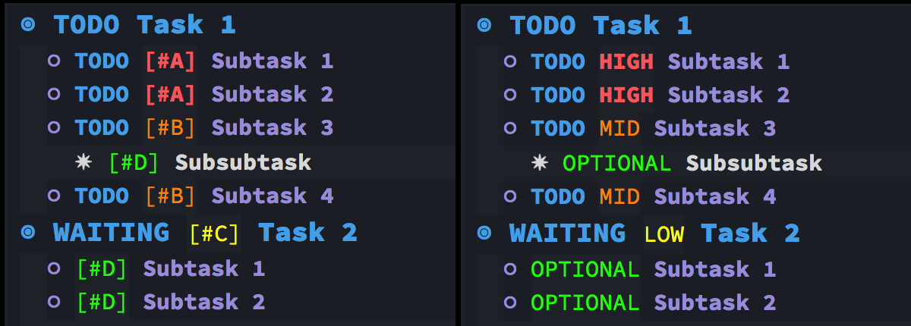
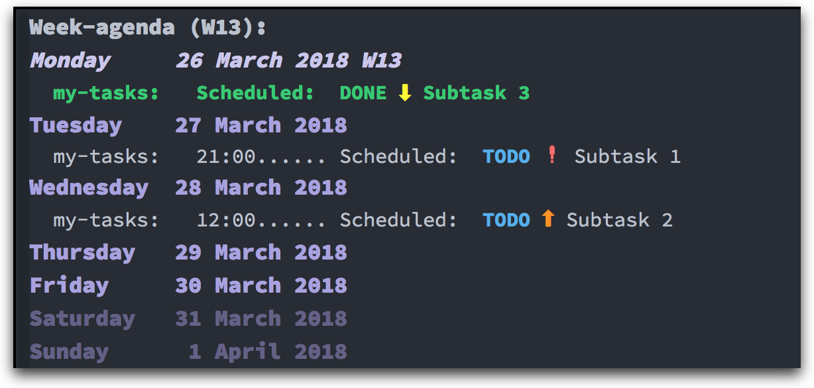

[](https://melpa.org/#/org-fancy-priorities)

# Org Fancy Priorities

Org mode is great. It is powerful, versatile and customizable. Unfortunately, I
always found the task priorities functionality a bit underwhelming, not in
terms of usability, but more in the visual department.

Inspired by [org-bullets](https://github.com/sabof/org-bullets), I created a
minor mode that displays org priorities as custom strings. This mode does
**NOT** change your files in any way, it only displays the priority part of a
heading as your preferred string value.

## Screenshots





## Installation

The package is available in [MELPA](https://melpa.org/#/org-fancy-priorities).
The code bellow will display the highest priority in each org file as ⚡, with
the rest of the symbols following in descending priority.

``` emacs-lisp
(use-package org-fancy-priorities
  :ensure t
  :hook
  (org-mode . org-fancy-priorities-mode)
  :config
  (setq org-fancy-priorities-list '("⚡" "⬆" "⬇" "☕")))
```

## Customization

If you use custom priority values for different files, you can explicitly set a
different string that will be matched to each one of them. See example below:

``` emacs-lisp
(setq org-fancy-priorities-list '((?A . "❗")
                                  (?B . "⬆")
                                  (?C . "⬇")
                                  (?D . "☕")
                                  (?1 . "⚡")
                                  (?2 . "⮬")
                                  (?3 . "⮮")
                                  (?4 . "☕")
                                  (?I . "Important")))
```

The "?" before each character is needed to convert each character to its integer
value, since Characters in Elisp are just integers.
